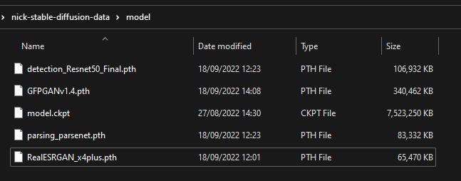
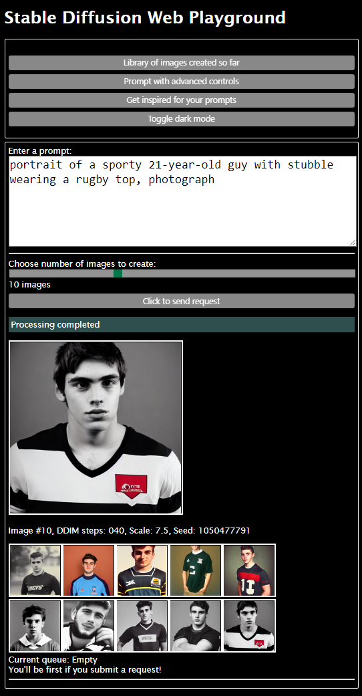
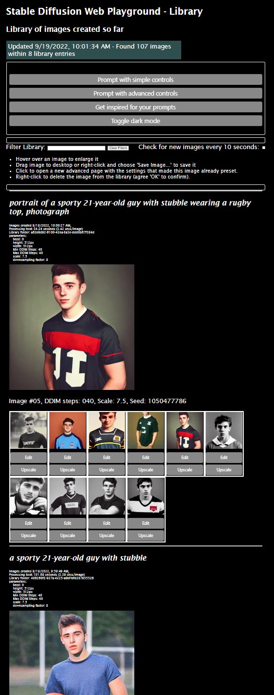
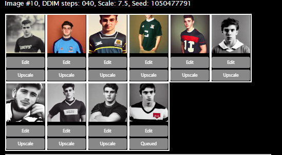
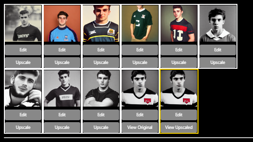
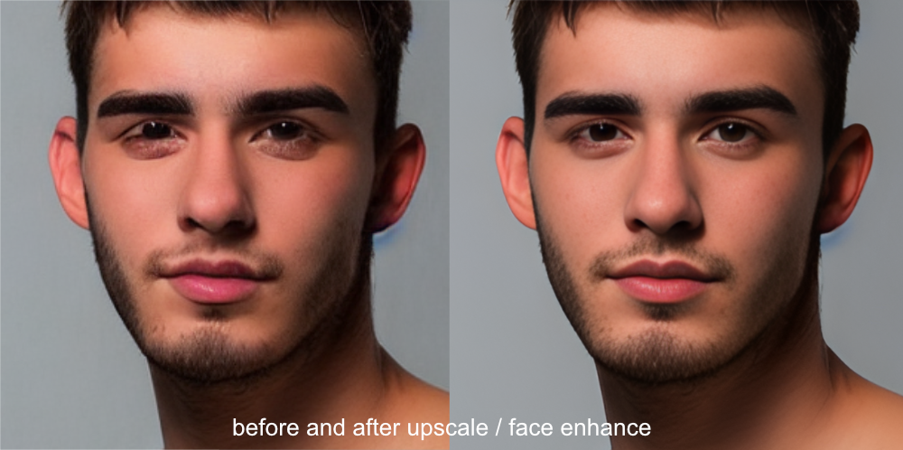
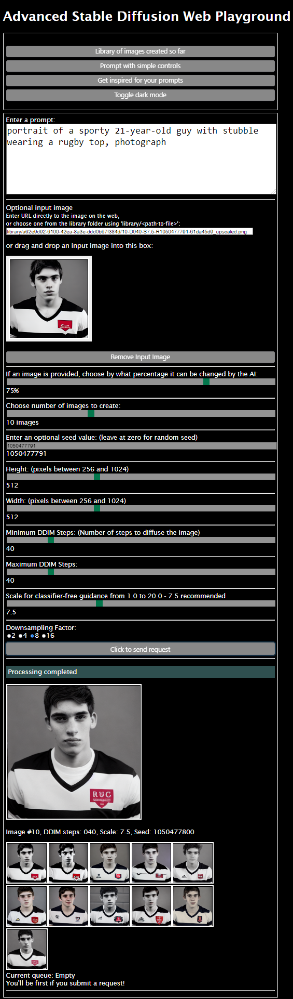

# Stable Diffusion Web Playground

### A multi-user web application powered by Docker Desktop running on your own Nvidia GPU-enabled Windows 10/11 Workstation 

#### Access with your web browser via http://localhost:8000 - and enable over your local network (and even the internet) for family and friends to play on together!

This project is formed from:

- https://github.com/CompVis/stable-diffusion - for Stable Diffusion image creation
- https://github.com/TencentARC/GFPGAN - for upscaling, enhancing and face restoration

I place these links here so that nobody forgets that I have simply stood on the shoulders of giants in making this interactive web version of Stable Diffusion.

I've built a docker-based multi-user web-based application around the original project which allows for extra features, and assumes
you are running Docker Desktop over WSL2 on Windows 10/11.

- Model-Always-Loaded backend server means that incoming requests go straight to creating images rather than
  model-loading.
- <b>UPDATE: Compatible with new v1.5 Stable-Diffusion model! </b>Which model to choose? In early tests of v1.5 I am finding that the overall quality, and particularly faces, are better with the larger model but there are plenty of exceptions as it is so subjective! I think v1.4 and 1.5 full model are tied on faces. Usefully, if you fix the seed number
   you can generate the same group of images in all three models, so you can compare them side by side. To do this, place all three model files in the 'model' folder, then take turns to rename each one to 'model.ckpt' and restart the backend server in Docker Desktop once the application is up and running.
   See step 2 in 'Installation Playbook' below. 
- NEW: Create a video from evolving frames, each image frame created acts as the input to the next image frame.
- Upscaling and face enhancements built-in! Just click 'Upscale' on any image in the application's Library page, or use 'auto-upscale' option in Advanced page
- Designed as a multi-user web application - get your family trying it on your home network, or set up your workstation
  as a internet-accessible server using ngrok or similar tunneling tool for your friends to try.
- Redis-based scheduler and queue management of prompts, so the backend only processes one prompt at a time.
- Simple non-framework UI that can be adapted as desired. The UI looks 'early 1990s' right now but it does its job.
- A simple API called by the JavaScript in the UI to send prompt requests, check the queue and see the library of
  results.
- Images appear as they are created rather than waiting for the whole batch to be created.
- API published at https://documenter.getpostman.com/view/10078469/2s7Z7Zou9h
- Create a DDIM-steps series of images by setting a minimum and maximum DDIM step value in the Advanced page. The images will be created in sequence from the minimum to the maximum value.
The DDIM step number will be added to each image's filename<pre>f"{image_counter + 1:02d}-D{ddim_steps:03d}-S{scale:.1f}-R{seed_value:0>4}-{str(uuid.uuid4())[:8]}.png")</pre>. This new feature unlocks all sorts of extra variations for the same prompt!
- DDIM-Steps now works with input images as well as just text prompts.
- Drag and drop an image into a box in the Advanced page to use it as the input image for the prompt. 
- docker compose volumes can be adjusted to save the pretrained image model, caches and output library of images on a
  disk outside of Docker.
- Manipulate images you have already created that reside in the library. Click on an image in the library and a new
  advanced page will open in a new tab with all the settings (seed, ddim_steps, scale, image link etc) used to create
  that image, so you can easily make variations by adjusting the controls.
- Advanced Page: Link to any image on the web and use that for the input image to the AI. You can adjust how much
  the image can be changed from 0.01% (no change) to 100% (no original image). You can also choose any image in the
  library folder on your machine (just move it there if necessary). The only condition is that the image can be
  retrieved without login and the website at the far end won't mind Python's urllib library pulling the image. Images
  are resized internally to 512x512px without affecting the original image's aspect ratio (black bands will appear on
  the top/bottom or left/right side of the longer edge to make it square). This aids the AI as it is finicky about sizes
  and size ratios.
- NEW: Enhance and rescale images using latest GPFGAN AI processing including face restoration, performed from Library page.
- The 'advanced.html' page gives you creative access to use input images, lock in the seed value, image size, DDIM
  Steps, Scale and Downsampling Factor. Bear in mind some settings can cause errors on the backend, so watch the backend
  server logs should your request disappear from the queue almost immediately with no results.
- The backend is written in Python and the UI is written in JavaScript.
- Output images are in PNG format so don't suffer from JPEG artifacts.
- NEW: 'dark mode' button for all the web pages, for those late-night creative AI sessions without being blasted by
  light!
- A stupid prompt inspiration page generating random and daft prompts. A good idea at the time.
- UPDATE: "Nick's Stable Diffusion Playground" web pages renamed "Stable Diffusion Web Playground" in deference to the fact that most 
people are not called 'Nick' and it's a bit more descriptive. The original name came from the fact it was personal, 
private project which I have only later realised may be of help to others. I should have thought of a decent name like
DALL-E and CrAIyon did, but we are where we are. I'm not changing the name of the GitHub repo though, as that would cause version control issues.

## Frequent updates!
This project is being improved throughout September/October 2022, so check back often for new features and bug fixes, plus improved help for getting 
the project working on your machine. Check the commits list for the latest changes at https://github.com/nicklansley/nick-stable-diffusion/commits

### Latest:
* NEW: Create a video from evolving frames!
* NEW: Added new 'auto-upscale' option in Advanced page, which will automatically upscale all images just created.
* Improved: 'Smarter' JavaScript in Library page only gets new images rather than the whole library every time you click the 'Refresh' button.
Indeed, the 'Refresh' button is now removed as the library is updated automatically every 5 seconds.
* NEW: Enhance and rescale images using latest GPFGAN AI processing including face restoration, performed from Library page.
* NEW: API published at https://documenter.getpostman.com/view/10078469/2s7Z7Zou9h

## Make sure your computer has everything ready
This section enables you to check that your computer has everything you need to run the application.
1. Make sure you have an NVidia graphics card and a NVidia's GPU driver installed. This is how the backend will render
   the images. You'll need an NVidia graphics card installed with onboard CUDA cores (such as their RTX-series) - see https://www.studio1productions.com/Articles/NVidia-GPU-Chart.htm).
2. The graphics card needs to have at least 8 GB of GPU memory of contiguous memory. I use an RTX 3090 Ti but should work on 3080s, 3070s
   and 2080s.
3. Check you have both WSL2 and a Linux distro such as Ubuntu installed. I use Ubuntu 20.04 LTS with 'bash' as the default shell. 
    To find out, open PowerShell and run this command:<pre>wsl --status</pre>
    You should get a response similar to this, showing you are using Version 2, your default distro is shown, and that the Kernel version is 5.x (or more recent of course):
    <pre>
    PS C:\Users\nick> wsl --status
    Default Distribution: Ubuntu
    Default Version: 2
    
    Windows Subsystem for Linux was last updated on 28/07/2022
    WSL automatic updates are on.
    
    Kernel version: 5.10.102.1
   </pre>

4. You have the latest edition of Docker Desktop installed, and it is running in WSL2 mode (in 'Settings' -> 'General', the 'Use the WSL 2 based engine' option is ticked).

## Test your computer
1. Open a terminal (bash) window in WSL2 and type the following command:
    <pre>nvidia-smi</pre>
    You should see a list of your graphics cards and their memory usage. If you don't see this, or the 'nvidia-smi' command
    cannot be found, you have a problem with your graphics card or driver:
    
    <pre>nick@FARSPACE:/mnt/s/Projects/nick-stable-diffusion$ nvidia-smi
    Mon Sep  5 07:38:22 2022       
    +-----------------------------------------------------------------------------+
    | NVIDIA-SMI 515.65.01    Driver Version: 516.94       CUDA Version: 11.7     |
    |-------------------------------+----------------------+----------------------+
    | GPU  Name        Persistence-M| Bus-Id        Disp.A | Volatile Uncorr. ECC |
    | Fan  Temp  Perf  Pwr:Usage/Cap|         Memory-Usage | GPU-Util  Compute M. |
    |                               |                      |               MIG M. |
    |===============================+======================+======================|
    |   0  NVIDIA GeForce ...  On   | 00000000:0A:00.0  On |                  Off |
    | 40%   30C    P8    21W / 480W |   1492MiB / 24564MiB |      6%      Default |
    |                               |                      |                  N/A |
    +-------------------------------+----------------------+----------------------+
    
    +-----------------------------------------------------------------------------+
    | Processes:                                                                  |
    |  GPU   GI   CI        PID   Type   Process name                  GPU Memory |
    |        ID   ID                                                   Usage      |
    |=============================================================================|
    |  No running processes found                                                 |
    +-----------------------------------------------------------------------------+
    </pre>
    If you saw some similar output to mine above, it means that WSL2 can see your graphics card and the driver is working.
    You can now close the WSL2/bash window.

2. Now open PowerShell and run this command which will download and set running NVidia's official docker container for CUDA 11.7, which
   is the version of CUDA that the backend uses. This is a big download, so it may take a while but it will save
   'docker compose' time doing this during <i>Fast Start</i> later:
    <pre>
    docker run --gpus all nvidia/cuda:11.7.1-cudnn8-runtime-ubuntu22.04 nvidia-smi
    </pre>
    This should produce <i>identical</i> output to the 'nvidia-smi' command you ran in WSL2 above. If it doesn't, you have a problem with your graphics card or driver.
     <b>UPDATE</b>: One person has documented an issue that running this step produces this output:
    <pre>
   Error response from daemon: failed to create shim: OCI runtime create failed: container_linux.go:380: starting container process caused: process_linux.go:545: container init caused: Running hook #0:: error running hook: signal: segmentation fault, stdout: , stderr:: unknown
   </pre>
   We are both trying to work out a fix for this 'segmentation fault' error so if you also get this error, please post a comment in the Github issue section for this project, issue name 'docker compose up -d --build: Error response from daemon: failed'.
   Please include your PC's CPU make/model, GPU card make/model, and PC memory. Thanks. I'll include a test for this here when we find the problem!
    
<b><i>If all has worked OK in this test section, you're all set.</i></b>
If not, head to https://docs.nvidia.com/cuda/wsl-user-guide/index.html and follow the instructions there to get your graphics card and driver working with WSL2.

## INSTALLATION PLAYBOOK
1. Read docker-compose.yml and adjust the three volumes to those suitable for your PC. On my S: hard drive I have created a folder '
   nick-stable-diffusion-data' and then created three empty sub-folders: 'cache', 'model' and 'library'.
   Docker will connect these physical locations to the internal volumes of the containers. You can change the 'device:'
   values to folders on your PC you would prefer the containers to use.
   
   
   If you are going to be running 'docker compose' (step 4) in PowerShell, use the Windows drive path format:
   <pre>
    volumes:
      app-cache-on-s:
        driver: local
        driver_opts:
          o: bind
          type: none
          device: S:\nick-stable-diffusion-data\cache
      model-on-s:
        driver: local
        driver_opts:
          o: bind
          type: none
          device: S:\nick-stable-diffusion-data\model
      library-on-s:
        driver: local
        driver_opts:
          o: bind
          type: none
          device: S:\nick-stable-diffusion-data\library
   </pre>
  If you are going to be running 'docker compose' (step 4) inside the terminal of a WSL2 distro such as Ubuntu, use the linux drive path format:
   <pre>
    volumes:
      app-cache-on-s:
        driver: local
        driver_opts:
          o: bind
          type: none
          device: /mnt/s/nick-stable-diffusion-data/cache
      model-on-s:
        driver: local
        driver_opts:
          o: bind
          type: none
          device: /mnt/s/nick-stable-diffusion-data/model
      library-on-s:
        driver: local
        driver_opts:
          o: bind
          type: none
          device: /mnt/s/nick-stable-diffusion-data/library
    </pre>
2. You will need to download the Stable Diffusion model - at the time of writing there is a v1.4 and two v1.5 of the model, one around half the file size of the other enabling it to work in NVidia GPUs with lower onboard memory.
   
   For v1.4 go here https://huggingface.co/CompVis/stable-diffusion-v-1-4-original and create an account. Then go back to this
   page to accept the terms.
   Then go here https://huggingface.co/CompVis/stable-diffusion-v-1-4-original/blob/main/sd-v1-4.ckpt
   and download this file.

   For v1.5, the model is at https://huggingface.co/runwayml/stable-diffusion-v1-5 and you can choose the 7.7GB model here: https://huggingface.co/runwayml/stable-diffusion-v1-5/resolve/main/v1-5-pruned.ckpt
   or go for the smaller 4.27GB model here: https://huggingface.co/runwayml/stable-diffusion-v1-5/resolve/main/v1-5-pruned-emaonly.ckpt

   
3. Copy the downloaded file to the 'model' folder you have setup in step 1. 
   You will need to place the .ckpt file there and rename it to <b>model.ckpt</b> - so in my case I now have:<pre>S:\nick-stable-diffusion-data\model\model.ckpt</pre> 
4. To use the GFPGAN AI to upscale your images and enhance the faces of any people featured, you will need to download these models which detect faces and enhance them as well as upscale the whole image. Follow these links to download:
- https://lansleycom.blob.core.windows.net/cdn-lansley-com/nsd_models/detection_Resnet50_Final.pth (104 MB)
- https://lansleycom.blob.core.windows.net/cdn-lansley-com/nsd_models/RealESRGAN_x4plus.pth (64 MB)
- https://lansleycom.blob.core.windows.net/cdn-lansley-com/nsd_models/parsing_parsenet.pth (82 MB)
- https://lansleycom.blob.core.windows.net/cdn-lansley-com/nsd_models/GFPGANv1.4.pth (332 MB)

- ... and save these files to the 'model' external folder you set up in step 1, alongside the Stable Diffusion model you downloaded in step 2 and copied in step 3. So now your model folder looks like this:
 
5. Run docker-compose to build the project then start the backend, scheduler and frontend. Downloading the container
   images is a one-time operation but takes time and several GB of download. If you ran the 'Test your computer' section
   above then the backend container image is already downloaded which will speed things up.
  I am happy to accept that right now the backend build is a bit overkill - I'm even having it download the Rust language 
   compiler, framework sources and then compile some of the required libraries using it while you wait. 
   Talk about freshly compiled code! Well at least it's a one-time thing; I'll clean it up later.
    
   <pre>docker compose up -d --build</pre>

6. At first start the backend will then download another 2.73 GB of data
   which it will store in the 'cache' folder you set up on your drive and set up in docker compose.
   This will only happen the first time - it doesn't do this every time you start the backend.
   The second and subsequent times you start the backend it will be live within about 30 seconds, sometimes sooner.
   You can't use the application until you see, in the backend server log:

    <pre>
    Backend Server ready for processing on port 8080
    </pre>

7. You can now start the UI by going to this web address on your web browser: <pre>http://localhost:8000</pre> - that's
   port 8000

## Notes

The UI is super-simple and is designed to be easily adapted to your needs. I've avoided frameworks so that you can add
yours as needed. I've written the JavaScript in a spaced out and 'pythonic' manner so it is easy to read (I hope!)

I've written the scheduler and frontend web server in Python. The Scheduler uses a simple FIFO queue to manage the
prompts with Redis as the queuing database. I've used a class based on BaseHTTPRequestHandler to handle the requests
from the UI.

## Simple UI / Home Page
Type in a prompt, choose the number of images and 'Click to send request'. The images will appear on the page as they are created: 

This page enables you to type in a prompt, choose the number of images you wish to create from 1 to 30,
and set the AI processing!
It's designed to be simple to use, with a random seed value generated for you.

Type in a prompt, set the number of images (from 1 to 30) and 'click to send request'.
The request will be queued and the scheduler will pick it up and process it. The scheduler will then send the results
back to the frontend web server which will then send the results back to the web page.

Once the images appear, hover over them with your mouse to make them much bigger. You can drag them onto your desktop
with your mouse to save them outside the library.

These images belong to you. They are your copyright. You can use them for whatever you wish.

If you don't want to wait, you can send several requests - just keep clicking the 'click to send request' button.
Your requests will be added to the queue. Note that only the last request you sent will result in images appearing on
the page,
but you can see all the requests as each completes on the library page (see below).

If you wish, you can use a service such as ngrok to get your computer a temporary web address on the internet, then your
friends submit prompts using the application, they will just get added to the queue and processed in turn. Indeed, the whole
application is designed for multi-user operation.

Behind the scenes for this simple prompting page, the ddim_steps is set to 40, scale is set to 7.5, image size is
512x512px and the downsampling factor is 8.
These defaults can be altered using the capital-letter variables at the top of script file backend-sd-server/server.py
if you wish to change them,
but these seem to work best and are suggested by the authors of the model. Use the advanced page to override them for
more control in a session.

## Library page
Images created by this application will appear in the library, where they can be upscaled (including having faces improved!) 

Images are grouped by prompt and date/time with the latest at the top of the page.
The group header also displays the various settings that either the AI used, or you set manually if you prompted via the advanced
page.

The page auto updates every 10 seconds with completed requests and upscaled images - no need to manually refresh.

The library page has been updated to improve the user experience with images:

* Hover over an image to see it in the larger 'master' view for that group.
* Drag image to your desktop to save it outside the libray folders.
* Click 'Edit' to open a new advanced page with the settings that made this image already preset so you can manipulate it
  further.
* Click 'Upscale' to use AI to carefully upscale the image to become four times in size, and also enhance the faces in the image.
  This is done using the GFPGAN AI. The image will be upscaled and the faces enhanced, and the result will be saved in the
  library alongside the original image. The original image will not be changed.
* When you click to upscale, your request actually joins the queue of requests waiting for the SD engine to process them. 
   This is because the SD engine processes one request at a time. Once upscaling has completed, the library page will auto-update with the upscaled image after a few seconds.
   

Queued for upscaling - click 'View Original' and 'View Upscaled' to see the results in a new browser window.

Result of upscaling in library:

Example of upscale / face-enhancement processing:

If you want to empty the library, simply go to the 'library' folder you created in 'Installation PLaybook' step 4 and delete
everything in it.

## Advanced Page
The Advanced page allows you to set the parameters for the AI to use when generating the image.
You can use this page to link to a source image on the web, or in your library folder.

Add an input prompt then fiddle with the controls! Drag and drop an image into the box to use it as the input image for the prompt.
Choose a min and max range of DDIM steps to create a series of images with different DDIM steps. The DDIM step number will be added to each image's filename.
Alter the classifier scale, and even choose your own starting seed for image creation consistency.

If you specify an image, it will be included as the first image '00-original.png' in the output.
<i>Note that you do not have copyright over the original image, only the AI-created images as long as they 
are 'substantially' different to the original. The only exception is of course if the original image was itself substantially created by this AI!</i>

## NEW! Video Page
See example in this project at https://github.com/nicklansley/nick-stable-diffusion/blob/master/nsd-example-video.mp4 (download only)
Create a video from a series of evolving images - each newly created image acts as the input to the next image in the series.
* Use a Zoom function to create a 'journey' through the images. 
* Decide how many images to create, and the frames per second that the video should playback at.
* You can decide by what percentage each frame can be different from the previous frame. The default is 40%.
* Provide your own input image as a starting frame.

## Example Workflow
1. Start with the 'simple' page and type in a prompt and keep the default creation of 3 images. 
2. Click to send the request.
3. Review the images as they appear on the page and adjust the prompt to tune the results.
4. Once you are getting close to the art you are looking for, expand the number of images up to a maximum of 30.
5. If you are happy with the direction the images are going in, click on an image which will open an 'Advanced' and use it as the input image for further manipulation.
6. <B>TIP</B>: If you are going to keep the same starting seed value and text prompt in step 5, you may wish to click 'Remove Input Image' to clear the input image, or the first generated image 
will be a 'double-generated' version of the input image. However, if you substantially change the prompt, you may wish to keep the input image as the first generated image will likely be a little different.
6. You can also click on images in the Library which will open a new Advanced page with all the settings pre=filled that created that image.
7. Adjust the number of images to be created to, say 10 and click to send the request. The first result will be close to the chosen image because the same seed was used that originally created it.
8. Start reducing the amount of change allowed by the AI by adjusting the 'Change' slider to closer to a lower percentage value. The images will be very similar to the original image.
9. If you want greater variety, remove the seed value, so a random seed starts being used.
10. As you finesse the images, you can start increasing its size by adjusting the 'height' and 'width' sliders to a higher value. The images will be larger and more detailed.
11. <B>TIP</B>: Always use an input image if you are going to increase the size of the images above 512x512 as that was the size of the training images used by the AI. If you go larger, you
may get weird art effects, such as a bizarre merging of two people into one. But hey, this is art so by all means experiment!
11. Adjust the 'scale' control to vary the 'polish' of the images. The higher the value, the more 'polished' the images will be (although this is subjective!)
12. If a 'better' image arrives but you want to finesses it, refresh the Library page then click on that image, and return to step 6.
13. Keep reducing the value of the 'Change' slider to tune the final look.
14. Finally, go the library and click 'Upscale' to use AI to carefully upscale the image to become four times in size, and also enhance the faces in the image.
15. Once you have completed your session, drag any images from the Library page to an external folder to keep, then go the /library folder and delete everything in it to start again.

## API

The API is a simple RESTful API that can be used by the UI to send requests into the application.
It is documented here (Postman compatible): https://documenter.getpostman.com/view/10078469/2s7Z7Zou9h

## Safety Catch / NSFW images

Note that I have disabled the safety catch and allow this project to create any image it desires. But doing so comes
with great responsibility and you must
not forget what you agreed to when downloading the model in <i>Installation Playbook</i>> above. 

If you prefer to avoid the possibility of NSFW content (for example, you are allowing minors to use the application or you are demonstrating this as a show & tell at 
work), re-enable the safety catch by setting SAFETY_FLAG to True in the backend-sd-server/server.py file.

I only disabled the safety catch because the NSFW replacement image was appearing too often on innocent prompts, notwithstanding the fact that my definition of 'innocent'
may be different to the developers of the safety catch...!

But have no illusion: Without the safety catch enabled, the AI will create any image it desires even on apparently 
innocent prompts, and it has no moral compass to help you unsee what it has created. 

## Licenses
See LICENSE page for details of licensing for this project

The favicon used by this application was generated using the following graphics from Twitter Twemoji:

- Graphics Title: 1f929.svg
- Graphics Author: Copyright 2020 Twitter, Inc and other contributors (https://github.com/twitter/twemoji)
- Graphics Source: https://github.com/twitter/twemoji/blob/master/assets/svg/1f929.svg
- Graphics License: CC-BY 4.0 (https://creativecommons.org/licenses/by/4.0/)

### Original PTH Model files source (where known - the original project downloaded them from an internal link!):
- https://github.com/xinntao/Real-ESRGAN/releases/download/v0.1.0/RealESRGAN_x4plus.pth
- https://github.com/TencentARC/GFPGAN/releases/download/v1.3.0/GFPGANv1.4.pth 
